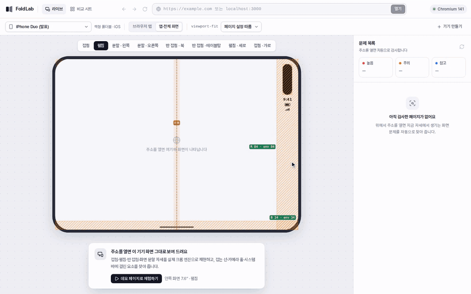
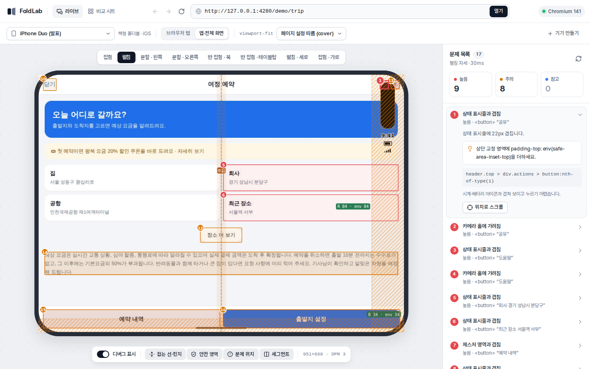
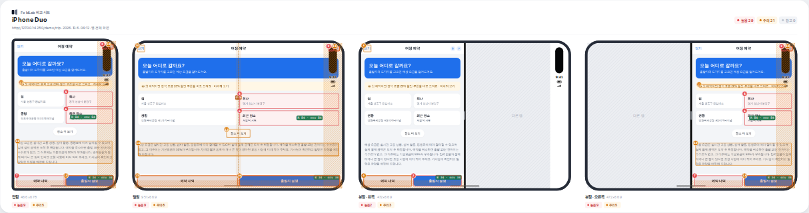

# FoldLab

폴더블·플립·듀얼 스크린 기기에서 웹사이트가 어떻게 보이는지 **자세별로 재현하고, 문제를 자동으로 찾아 주는 디버거**입니다.
주소를 넣으면 실제 크롬 엔진(헤드리스 크로미움)으로 접힘·펼침·반 접힘·화면 분할 자세를 차례로 재현합니다.
그리고 접는 선·힌지·카메라 홀·시스템 바에 걸린 요소를 기기 프레임 위에 표시합니다.
내 PC에서 띄워 쓰는 로컬 도구라 `localhost` 개발 서버와 배포된 페이지를 모두 검사할 수 있습니다.

## 시연 영상



주소를 넣어 데모 페이지를 열고, 문제를 눌러 위치를 확인하고, 기기 화면을 직접 스크롤합니다.
이어서 아이폰 듀오의 접힘·분할·반 접힘 자세와 갤럭시 Z 플립8로 바꿔 보고, 비교 시트로 네 자세를 한 장에 캡처합니다.
고화질 영상(1920×1200, MP4)은 [docs/media/foldlab-demo.mp4](docs/media/foldlab-demo.mp4)에 있습니다.

| 라이브 화면 | 비교 시트 |
|---|---|
|  |  |

## 무엇을 할 수 있나요

- **라이브 디버깅**: 기기 프레임 안의 화면을 클릭(탭)·드래그(스크롤)·휠·키보드(한글 IME 포함)로 직접 조작합니다. 자세를 바꾸면 같은 페이지가 실제 기기처럼 크기·세그먼트·자세·안전 영역을 바꿔 다시 그립니다.
- **자동 검사**: 화면이 바뀔 때마다 24개 규칙으로 검사하고 높음·주의·참고로 나눠 보여 줍니다. 문제를 누르면 원인 요소, CSS 선택자, 고치는 방법이 나오고 "위치로 스크롤"할 수 있습니다.
- **디버그 표시**: 접는 선·힌지 위험 구역, 안전 영역(상태 표시줄·카메라·제스처 영역·둥근 모서리)을 빗금으로 표시합니다. 가장자리마다 실제 가림 깊이와 페이지가 받은 `env()` 값을 비교해 보여 줍니다(예: `R 84 · env 0`). 뷰포트 세그먼트와 문제 위치도 표시합니다.
- **비교 시트**: 고른 자세를 차례로 바꿔 가며 캡처해 기기 프레임째 한 장으로 만들고 자세별 문제 수를 적습니다. PNG 저장·이미지 복사·Markdown 복사로 PR이나 Jira에 바로 붙일 수 있습니다. 디버그 표시를 빼고 실제 화면만 찍을 수도 있습니다.
- **자세 전환 연속성 검사**: 접거나 펼칠 때 페이지가 새로 로드되는지 확인합니다. 입력값·스크롤 위치·동영상 재생이 유지되는지도 봅니다.
- **표시 방식**: 모바일 브라우저 탭(크롬 안드로이드·사파리)과 앱 웹뷰·전체 화면(PWA)을 나눠 재현합니다. 둘은 안전 영역 동작이 다릅니다.
- **기기 직접 만들기**: 카탈로그에 없는 기기를 값으로 정의하고 JSON으로 팀과 공유할 수 있습니다.

## 지원 기기 (2026-10 기준)

| 종류 | 기기 |
|---|---|
| 책형 폴더블 | **iPhone Duo**, Galaxy Z Fold8, Galaxy Z Fold8 Ultra, Galaxy Z Fold7, Galaxy Z Fold6, Pixel 10 Pro Fold |
| 플립 | Galaxy Z Flip8, Galaxy Z Flip7, Galaxy Z Flip6 |
| 트라이폴드 | Galaxy Z TriFold |
| 듀얼 스크린(레거시) | Surface Duo 2, Surface Duo |

기기마다 아래 자세를 제공합니다:

| 자세 | 설명 |
|---|---|
| 접힘(커버 화면) | 접은 채 바깥 화면 |
| 펼침 | 안쪽 화면을 평평하게 |
| 분할 · 왼쪽 / 오른쪽 | 화면 분할(Split View) |
| 반 접힘 · 북 / 테이블탑 / 플렉스 | Viewport Segments 2개, Device Posture `folded` |
| 가로·세로 회전 | |

치수는 공식 사양과 실기기 측정값을 기준으로 했습니다. 크롬 개발자 도구 프리셋 중에는 실기기와 다른 것이 있어 쓰지 않았습니다.
근거와 출처는 [docs/RESEARCH.md](docs/RESEARCH.md)에 정리했습니다.

## 빠르게 시작하기

Node.js 20.19 이상이 필요합니다.

```bash
npm install
npm run browsers   # 처음 한 번: 크로미움 내려받기 (npx playwright install chromium)
npm run dev        # http://localhost:5280 (UI) + http://127.0.0.1:4280 (서버)
```

브라우저에서 <http://localhost:5280>을 열고 주소를 넣으세요. 바로 써 보려면 **데모 페이지로 체험하기**를 누르세요.
`http://localhost:3000` 같은 로컬 개발 서버도, 배포된 사이트 주소도 열 수 있습니다.

개발 모드 대신 빌드해서 한 포트로 띄우려면:

```bash
npm run build
npm start          # http://127.0.0.1:4280
```

`?url=…&device=iphone-duo&posture=unfolded&mode=app` 쿼리를 붙이면 그 설정으로 바로 엽니다. 자주 보는 페이지를 북마크해 두면 편합니다.

## 사용 방법

1. **주소 입력**: 스킴이 없으면 자동으로 붙입니다(localhost·사설 IP는 `http://`, 나머지는 `https://`).
2. **기기와 표시 방식 선택**:

   | 표시 방식 | 재현하는 환경 |
   |---|---|
   | 브라우저 탭 | 크롬 안드로이드는 위쪽 주소창, 사파리는 아래쪽 탭 바(아이폰 듀오는 옆 막대). 크롬 탭은 카메라 쪽을 비우고 폭을 줄이며, `viewport-fit=cover`일 때만 제스처 영역 아래까지 그립니다(크롬 135+ 엣지 투 엣지) |
   | 앱·전체 화면 | 웹뷰나 PWA처럼 화면 끝까지 그립니다. 안드로이드 웹뷰는 `viewport-fit`과 상관없이 시스템 바·카메라 영역을 안전 영역으로 줍니다 |

   `viewport-fit` 선택을 바꾸면 페이지 설정 대신 cover·auto를 강제로 적용해 비교할 수 있습니다.
3. **자세 전환**: 기기 위의 자세 막대에서 자세를 바꿉니다. 같은 페이지 상태 그대로 바뀌므로 연속성 문제도 함께 나옵니다. 아래 도크에서 디버그 표시 항목(접는 선·힌지, 안전 영역, 문제 위치, 세그먼트)을 켜고 끕니다.
4. **문제 확인**: 오른쪽 목록과 화면 위 번호 표시가 같은 순서입니다. 목록을 누르면 설명과 해결 방법이 나오고, 위쪽 등급 칸(높음·주의·참고)을 누르면 그 등급만 걸러 봅니다.
5. **비교 시트**: "비교 시트" 탭에서 자세를 고르고 캡처한 뒤 PNG·이미지 복사·Markdown으로 내보냅니다.

## 검사 규칙

| 규칙 | 찾는 문제 |
|---|---|
| 접는 선 위 조작 요소 | 버튼·입력이 접는 선에 걸치거나 너무 가까움(반 접힘 ±24px, 아이폰 듀오 40pt 띠) |
| 힌지에 가려짐 | 듀얼 스크린 힌지 아래로 들어가 보이지 않는 요소 |
| 접는 선을 가로지르는 텍스트·미디어 | 반 접힘에서 두 면으로 갈라지는 문단·이미지 |
| 카메라 홀에 가려짐 / 상태 표시줄·제스처 영역과 겹침 / 둥근 모서리에 잘림 | 안전 영역 침범 |
| 가로 스크롤 / 잘린 텍스트 | 좁은 커버 화면·분할 창에서 넘침 |
| 다른 요소에 가려짐 | 고정 헤더·하단 바·오버레이 때문에 스크롤해도 누를 수 없음 |
| 작은 터치 영역 | WCAG 2.5.8(24×24) 미달 |
| 너무 긴 줄 / 넓은 화면 미활용 | 펼친 화면에서 줄 길이(한중일 40자)·좁은 단일 열 |
| 뷰포트 메타 누락 / 확대 막힘 | `width=device-width` 없음, `user-scalable=no` |
| 고정 요소 과점유 | 낮은 화면(플립 커버 등)을 고정 요소가 30% 넘게 덮음 |
| 화면 방향 강요 | "화면을 돌려 주세요" 오버레이 |
| 스크롤 안 되는 오버레이 | 내용이 넘치는데 스크롤할 수 없는 고정 메뉴·대화상자 |
| 스크롤 시 하단 가림 | 크롬 135+에서 chin이 사라지면 제스처 영역에 가려지는 하단 고정 바 |
| 자세 전환 시 상태 유실 | 새로 로드, 입력값·스크롤 위치·재생 상태 유실 |
| 안전 영역 미사용 / 레터박스 / 접힘 대응 코드 없음 | `env(safe-area-inset-*)`·viewport segments·device posture 사용 여부 |

## 동작 원리

```
브라우저(UI, React)  ──WebSocket──▶  Node 서버(Express + ws)  ──CDP──▶  헤드리스 크로미움(Playwright)
  기기 프레임·디버그 표시(SVG)          세션마다 브라우저 컨텍스트 1개            setDeviceMetricsOverride(+displayFeature, devicePosture)
  화면 프레임(JPEG) 그리기               화면 스트리밍·입력 전달·캡처              setDevicePostureOverride / setSafeAreaInsetsOverride
  문제 목록·비교 시트·PNG 내보내기       기하 계산(shared/geometry.ts)            격리된 월드에서 분석기(inpage/analyze.ts) 실행
```

| 위치 | 역할 |
|---|---|
| `shared/devices.ts` | 기기 카탈로그 |
| `shared/geometry.ts` | 자세마다 뷰포트·안전 영역·디스플레이 기능·장애물(카메라·바·모서리·접는 선)을 계산합니다. UI와 서버가 함께 씁니다 |
| `server/session.ts` | CDP로 에뮬레이션을 걸고 화면을 스트리밍합니다. 터치·휠·키 입력 전달, 자세 전환 연속성 검사, 비교 시트 캡처도 맡습니다 |
| `inpage/analyze.ts` | 페이지 안 격리된 월드에서 DOM을 훑어 규칙을 검사합니다. 페이지 자바스크립트와 섞이지 않습니다 |
| `web/` | React UI. 기기 프레임과 디버그 표시를 SVG로 그려 그대로 PNG로 내보냅니다 |

헤드리스 크로미움 에뮬레이션에서 확인한 함정과 우회 방법(세그먼트 인자, 자세 초기화, 배율 잔상 등)은 [docs/RESEARCH.md](docs/RESEARCH.md#4-헤드리스-크로미움-에뮬레이션cdp)에 정리했습니다.

## 설정(환경 변수)

| 변수 | 기본값 | 설명 |
|---|---|---|
| `FOLDLAB_PORT` | `4280` | 서버 포트 |
| `FOLDLAB_HOST` | `127.0.0.1` | 바인드 주소. 외부에 열려면 `0.0.0.0` |
| `FOLDLAB_ALLOW_PRIVATE` | 루프백이면 `1`, 아니면 `0` | localhost·사설망 주소 열기 허용 여부. 외부에 공개하는 서버는 끄세요(SSRF 방지) |
| `FOLDLAB_MAX_SESSIONS` | `6` | 동시 세션 수(세션마다 브라우저 컨텍스트 1개) |
| `FOLDLAB_IDLE_MINUTES` | `20` | 조작이 없으면 세션을 닫는 시간 |
| `FOLDLAB_CHROMIUM_PATH` | | 쓸 크로미움 실행 파일. 없으면 Playwright 브라우저를 찾고, 버전이 안 맞으면 캐시에 있는 다른 리비전을 씁니다 |
| `FOLDLAB_ALLOWED_ORIGINS` | | 웹소켓을 허용할 추가 출처(쉼표 구분). 기본은 같은 출처만 허용합니다 |

## Docker로 실행하기

Node.js를 설치하지 않고 띄우고 싶을 때 씁니다.

```bash
docker build -t foldlab .
docker run --rm -p 127.0.0.1:4280:4280 foldlab     # http://localhost:4280
```

컨테이너 안의 `localhost`는 내 PC가 아닙니다. 내 PC의 개발 서버를 열려면 사설망을 허용하고 `host.docker.internal`로 접속하세요.
리눅스에서는 `--add-host=host.docker.internal:host-gateway`도 붙여야 합니다.

```bash
docker run --rm -p 127.0.0.1:4280:4280 -e FOLDLAB_ALLOW_PRIVATE=1 \
  --add-host=host.docker.internal:host-gateway foldlab
# 주소 입력: http://host.docker.internal:3000
```

이미지에는 한글 글꼴(Noto CJK)이 들어 있어 캡처의 한글이 깨지지 않습니다.

## 보안

- FoldLab은 내 PC에서 쓰는 **로컬 도구**입니다. 서버가 사용자가 넣은 주소를 대신 열기 때문에 인터넷에 공개하지 마세요. 기본 설정은 `127.0.0.1`에만 열립니다.
- 루프백이 아닌 주소에 열면 `FOLDLAB_ALLOW_PRIVATE`가 꺼져 사설망·클라우드 메타데이터 주소 요청을 막습니다. 단, 페이지 안 웹소켓 연결과 DNS 리바인딩까지 완벽히 막지는 못합니다.
- 다른 사이트가 사용자 몰래 로컬 FoldLab에 접속해 브라우저를 조종하지 못하게 웹소켓 `Origin`을 확인합니다.
- 페이지의 `confirm()`은 취소로 처리해 삭제 같은 동작이 실수로 실행되지 않게 합니다. `alert()`는 확인을 누르고 UI에 알려 줍니다.

## 한계

- 렌더링 엔진은 **크로미움**입니다. 아이폰 듀오는 화면 크기·UA·안전 영역만 흉내 내고 WebKit 고유 동작은 재현하지 않습니다. 최종 확인은 실기기(Samsung Remote Test Lab, Xcode 시뮬레이터 등)로 하세요.
- 크롬은 디스플레이 기능을 하나만 받습니다. 트라이폴드의 두 번째 접는 선은 기하 검사에만 씁니다.
- 줄었다 늘어나는 주소창(동적 툴바)은 재현하지 않습니다.
- 삼성 "화면 크기(줌)" 설정을 바꾸면 실제 CSS 폭이 달라집니다. 카탈로그 값은 기본 설정 기준입니다.

## 개발

```bash
npm run dev         # 서버(tsx watch) + UI(vite)
npm run typecheck   # tsc --noEmit
npm test            # 단위 테스트(기하) + 통합 테스트(실제 크로미움으로 데모 페이지 검사)
npm run smoke       # 서버가 떠 있을 때 웹소켓으로 열기·분석·캡처 점검
npm run record:demo # 서버가 떠 있을 때 시연 영상(docs/media) 다시 만들기, ffmpeg 필요
```

시연 영상은 `scripts/record-demo.ts`가 실제 UI를 자동으로 조작하며 녹화합니다. UI를 바꾼 뒤 다시 실행하면 README 영상도 함께 갱신됩니다.

데모 페이지 `server/demo/trip.html`에는 일부러 문제를 넣었습니다(안전 영역 무시, 접는 선 위 버튼, 고정 폭 배너, 작은 아이콘 버튼). `?fixed`를 붙이면 `env(safe-area-inset-*)`와 viewport segments로 고친 버전이 됩니다.

## 앞으로 할 일

- [ ] iPhone Duo 실측 보정: 실기기·Xcode 시뮬레이터에서 화면 크기·안전 영역을 재는 `/measure` 페이지를 만들고 카탈로그에 반영 (10월 23일 출시 후)
- [ ] 아이폰 기기용 WebKit 렌더링 엔진(Playwright WebKit)
- [ ] 페이지 전체 검사와 폭 스윕("몇 px부터 깨지는지")
- [ ] 가상 키보드와 줄었다 늘어나는 주소창(동적 툴바) 재현
- [ ] 삼성 인터넷·네이버 웨일 프로필
- [ ] 타입 검사·테스트 CI
